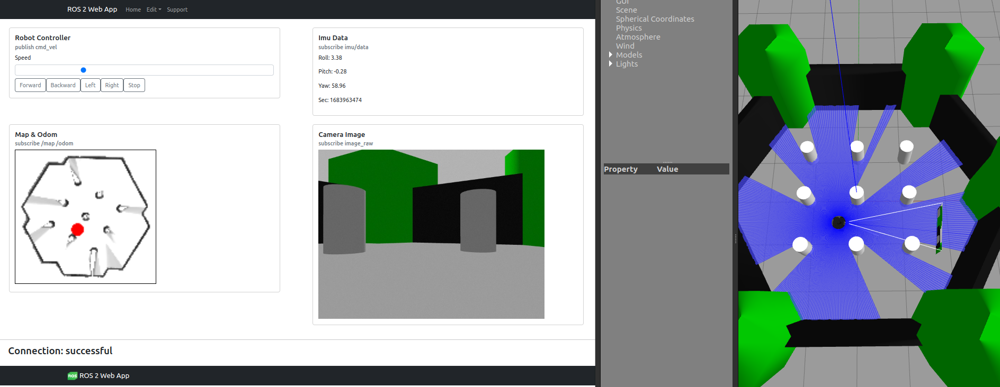

# ros2_robot_react_app

[](https://github.com/tasada038/ros2_robot_react_app/stargazers/)
[](https://github.com/tasada038/ros2_robot_react_app/network/)
[](https://github.com/tasada038/ros2_robot_react_app/issues/)
[](https://github.com/tasada038/ros2_robot_react_app/blob/master/LICENSE)

## Overview

React Application for ROS 2 Robot

## ros brdige

```
sudo apt install -y ros-$ROS_DISTRO-rosbridge-suite
```

## Installation

```
cd your_ws
git clone https://github.com/tasada038/ros2_robot_react_app.git
cd ~/your_ws/ros2_robot_react_app
npm install
```

## Run

First shell, run ros2_robot_react_app in the browser
```
cd ~/your_ws/ros2_robot_react_app
npm start
```

Second shell, launch the rosbridge_server
```
source /opt/ros/{distro}/install/setup.bash
ros2 launch rosbridge_server rosbridge_websocket_launch.xml
```

access the browser below.

```
  Local:            http://localhost:3000
```



## Publish and Subscribe Topics
The topics of the ros2_robot_react_app are as follows.

Publish data
- /cmd_vel

Subscribe data
- /color/image_raw/compressed
- /bno055/imu/data
- /map
- /odom